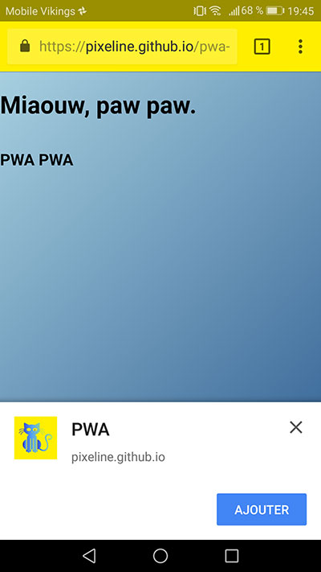

# PWA Sample project

This is a working example of a Progressive Web Application, made using a GitHub page. If done correctly, Android users should see a native invitation to save the website on their homescreen.

- Read the article "[Learn how to turn a website into a Progressive Web App](https://dev.to/pixeline/the-easy-way-to-turn-a-website-into-a-progressive-web-app-77g)".
- Visit [the GitHub page](https://pixeline.github.io/pwa-example/index.html) using your mobile phone to test it.

This is a boilerplate for junior developers at [BeCode](http://www.becode.org) and anyone wanting to learn more about PWA.

